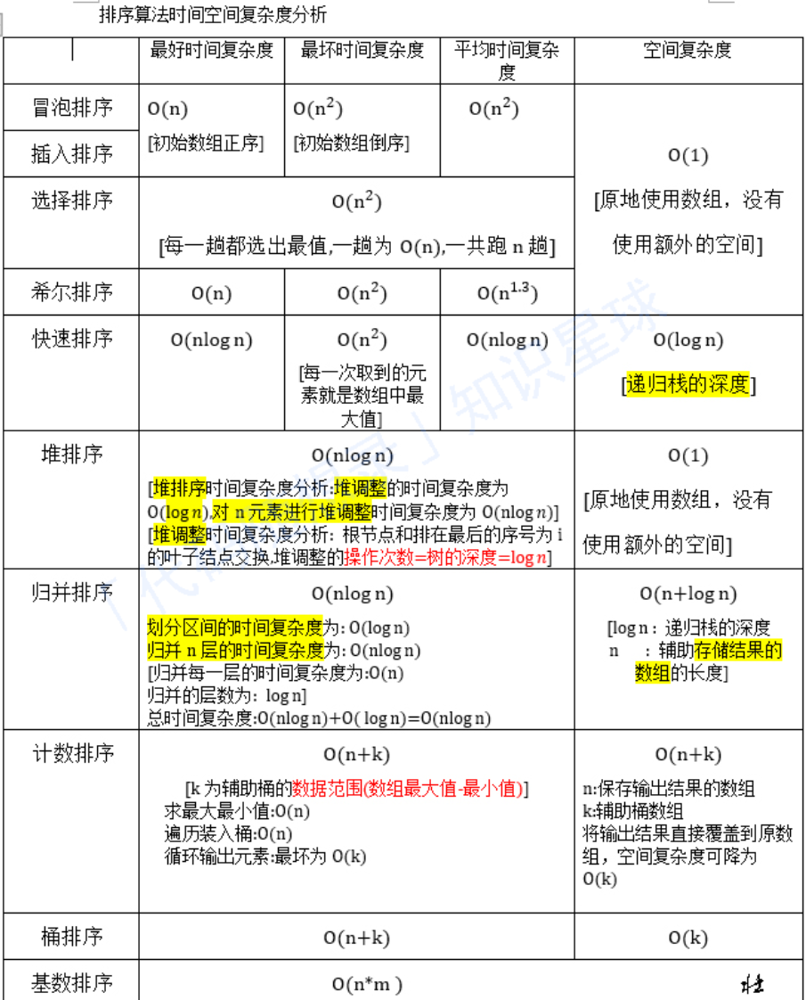

# C/CPP
## 1、虚函数表剖析
[虚函数表、虚表指针、动态绑定和多态](https://zhuanlan.zhihu.com/p/75172640 )

## 2、define和typedef的区别？
-   define用来定义常量及书写复杂内容;typedef主要用于定义类型别名
-   define发生在编译前预处理阶段；typedef是编译的一部分
-   define不检查类型；typedef检查数据类型
-   define不是语句，末尾不需要加分号；typedef是语句，要加分号标识结束
-   define和typedef对指针的操作区别巨大，比如：`define p_char char*`和`typedef char* p_char_`，在同时定义多个变量时区别巨大。
```c
#include <stdio.h>

//define定义宏时，使用()来保证不出错误
#define Min(A, B)  ((A) <= (B) ? (A) : (B))
#define p_char char*
typedef char* p_char_;
int main () {
    int a = 5;
    int b = 4;
    printf("%d\n",Min(5, 4));
    p_char p1, p2;
    //替换成
    //char* p1,p2;
    //p2为char类型?
    printf("%d,%d\n", sizeof(p1), sizeof(p2));
    p_char_ p3, p4;
    //char* p3; char* p4;
    printf("%d,%d\n", sizeof(p3), sizeof(p4));
}
```
>使用`gcc -E` 将`defin.c`宏展开得到`define_expanded.c`,查看内容：
```c
typedef char* p_char_;
int main () {
    int a = 5;
    int b = 4;
    printf("%d\n",((5) <= (4) ? (5) : (4)));
    char* p1, p2;
    printf("%d,%d\n", sizeof(p1), sizeof(p2));
    p_char_ p3, p4;
    printf("%d,%d\n", sizeof(p3), sizeof(p4));
}
```
```bash
PS D:\VScodeProject\C_CPP\C> gcc .\标准define宏.c -o define
PS D:\VScodeProject\C_CPP\C> .\define.exe
4
8,1
8,8
PS D:\VScodeProject\C_CPP\C> gcc -E -P .\标准define宏.c > define_expanded.c
```
为什么`sizeof(2) = 1`? `p2`为`char`类型。

## 3、sizeof和strlen的区别？
-   `sizeof`是运算符,并不是函数，在编译时得到而非运行时;`strlen`是C库中的字符串处理函数
-   `sizeof`的参数可以是任意数据类型或者数据;`strlen`的参数必须是字符指针且结尾是`\0`的字符串
-   `sizeof`在编译时得到，所以不能用来得到动态分配存储空间的大小
```c
#include <stdio.h>
#include <string.h>

int main() {
    int x = 5;
    int *p = &x;
    printf("%d %d\n", *p, sizeof(p));
    //printf("%d %d\n", q, sizeof(q));
    //结果
    // 5  8  64位操作系统指针本身的大小是8字节;32位是4字节
    // 5  4

    //sizeof和strlen对字符串的处理
    char *str = "it's time to study";
    printf("%d,%d\n", sizeof(str), strlen(str));

    //计算数组大小
    int arr[5] = {1,2,3,4,5};
    printf("%d\n", sizeof(arr)/sizeof(arr[0]));

    //sizeof传入数据类型或数据，返回对应数据类型或数据的字节数
    int i = 0;
    char a = 'b';
    char *b = "abc";
    printf("%d\n",sizeof(i));
    printf("%d\n",sizeof(0));
    printf("%d\n",sizeof(a));
    printf("%d\n",sizeof('b')); // ? 4
    printf("%d\n",sizeof(b));
    printf("%d\n",sizeof("abc")); // ? 4
}
```
```bash
PS D:\VScodeProject\C_CPP\C> cd "d:\VScodeProject\C_CPP\C\" ; if ($?) { gcc sizeof引用和指针.c -o sizeof引用和指针 } ; if ($?) { .\sizeof引用和指针 }
5 8
8,18
5
4
4
1
4
8
4
```
> `sizeof('b') = 4 ?`在C99标准下,`'b'`为整形字符常量，被当作`int`类型；在ISO C++标准下, `'b'`是字符字面量，被看作`char`类型。
> `sizeof("abc") = 4 ？` `"abc"`为字符串，会在末尾自动加上`\0`字符，即数据`0x00`

## 4、常量指针和指针常量的区别？
如何区分？判断离变量名近的类型：如`const int *p`,`p`离`*`较近，即`p`是一个指针类型，`const int`表示指针指向的变量是常量，不可以被修改；同理,`int *const p`
- `const int *p`:常量指针，指针指向可以更改，指向的值不可以修改;`int *const p`：指针常量,指针的指向不可以更改，指向的值可以修改。

## 5、数组名a与&a的区别？
```c
#include <stdio.h>

int main() {
    int arr[10] = {0, 1,2,3,4,5,6,7,8,9};
    int len = sizeof(arr) / sizeof(arr[0]);
    int i = 0;
    for (;i < len; i++) {
        printf("%d", *(arr + i));
    }
    printf("\n");
    printf("%p\n", arr);
    int (*p)[10] = &arr;
    printf("%d\n",*(arr + 10));
    printf("%p, %d, %d\n", p, *(int*)p, *(int*)(p + 1));
}
```
```bash
PS D:\VScodeProject\C_CPP\C> cd "d:\VScodeProject\C_CPP\C\" ; if ($?) { gcc arr.c -o arr } ; if ($?) { .\arr }
0123456789
000000000061FDE0
33
000000000061FDE0, 0, 33
```
-   `arr`是数组名，是数组首元素地址，`+1`表示指针加1,内存地址加1 * int类型所占的字节数,即4。`*(a+1) = a[1]`
-   `&arr`是数组指针，类型为`int (*p)[]`(数组指针)，其加1时，为数组首地址加上整个数组的偏移(10个int变量),值为数组`arr`尾元素后一个元素的地址，具体值不确定。
-   若想输出指针`p`指向的值，需要将`p`强制转换成`(int*)p`,`*(int*)p = a[0]`

## 6、new、delete和malloc、free的区别?
-   `new、delete`是C++的关键词;`malloc、free`是C语言标准库函数
-   `new、delete`调用`operator new、operator delete`,`operator new、operator delete`调用`malloc、free`,`new、delete`与对象构造析构组合在一起
-   `new`无需指定内存的大小，失败返回`bad_alloc`，成功返回对象类型的指针；`malloc`需要指定申请内存的大小，失败返回`NULL`,成功返回`void*`，需要强制类型转换成我们需要的类型。
```c
#include <stdio.h>
#include <malloc.h>
#include <string.h> 
int main () {
    char *p = (char *)malloc(sizeof(char));
    int array[100] = {0};
    //对malloc函数分配的内存清理垃圾值
    //bzero(p, 1);
    //memset是按照内存中一个一个字节的进行赋值的
    memset(array, 0, 100);
    free(p);
    printf("%d\n", array[0]);
}
```

## 7、常见位运算:求二进制中1的个数、0的个数;设置某位、清除某位;交换两数
```c
#include <stdio.h>

#define BIT3 (0X1 << 3) 
// 0X1: 0001 << 3
//      1000 
static int c = 0;
//求解整数型的二进制中1的个数
// x&(x-1) 可以把x对应的二进制数中最后一位1去掉
//注： x&(x-1)可以判断x是否为2的幂
/**
例如:
    9: 1001
    8: 1000
    --------
       1000
    
    8: 1000
    7: 0111
    -------
       0000
    结束，可以发现9的二进制数中有2个1
*/
int calCountOfOne(int num) {
    int count_of_one = 0;
    while (num) {
        count_of_one++;
        num = num & (num -1);
    }
    return count_of_one;
}

//求解整数型的二进制中0的个数
// x|(x+1)
/*
例如：
    9： 1001
        1010
        1011 -> 1011

        1101
        1110 -> 1111

       10000结束 -> 二进制中0的个数为2
*/
int calCountOfZero(int num) {
    int count_of_zero = 0;
    while (num + 1) {
        count_of_zero++;
        num = num | (num + 1);
    }
    return count_of_zero;
}

//给定一个整数变量a,设置a的bit3为1,保持其他位不变
void set_bit3(void) {
    c |= BIT3;
}

//给定一个整数变量a,设置a的bit3为0,保持其他位不变
void clear_bit3(void) {
    c &= ~BIT3;
}


int main() {
    printf("%d\n", calCountOfOne(9999));
    printf("%d\n", calCountOfZero(9999));
    //交换两个变量的值，不使用第三个变量
    /**
        1、使用加减法
        2、异或
    */
    int a = 3, b = 5;
    printf("交换前:a = %d, b = %d\n", a, b);
    // a = a + b; // a = 8
    // b = a - b; // b = 3
    // a = a - b; // a = 5
    a = a^b;
    b = a^b;
    a = a^b;
    printf("交换后:a = %d, b = %d\n", a, b);

    set_bit3();
    printf("0x%x\n", c);
    clear_bit3();
    printf("0x%x\n", c);
    return 0;
}
```
```bash
PS D:\VScodeProject\C_CPP\C> cd "d:\VScodeProject\C_CPP\C\" ; if ($?) { gcc 位操作.c -o 位操作 } ; if ($?) { .\位操作 }
8
24
交换前:a = 3, b = 5
交换后:a = 5, b = 3
0x8
0x0
```
## 8、从一个C语言程序到可执行文件的过程？
>从源文件到可执行文件的过程：预处理->编译->汇编->链接->可执行文件
-   预处理：`gcc -E test.c test.i`,将`#include、#define`展开
-   编译：`gcc -S test.i test.s`,生成汇编文件
-   汇编: `gcc -c tets.s test.o`,汇编码转换成机器码
-   链接：将汇编接受后的目标文件和库文件打包生成可执行文件
-   可执行文件：`./test.o`

## 9、静态库和动态库的区别？
-   静态库在编译时链接到目标程序,链接器从库中复制这些函数和数据并把它们和应用程序的其它模块组合起来创建最终的可执行文件，最后生成的可执行文件较大，通常以`.a`结尾；动态库在可执行文件运行时载入内存，在编译过程中仅仅简单的引用(仅保留接口)，最后生成的可执行文件相对较小,通常以`.so`。
-   静态库和动态库都是由`.o`文件创建的


## 10、常见C字符串函数实现?
-   `memmove`、`memcopy`将源字符串指针指向的`len`字节复制到目的字符串指针指向的位置，`memmove`考虑到源字符串与目的字符串内存折叠的情况，而`memcopy`没有考虑(需要用户自己确定)
```c
#include <string.h>
#include <stdio.h>

void *my_memmove(void *vdst, void *vsrc, size_t n) {
    char *dst = (char *)vdst;
    char *src = (char *)vsrc;
    //若vsrc在vdst右边，顺序遍历执行即可，vsrc被改变
    if (src > dst) {
        while (n-- > 0) {
            *dst++ = *src++;
        }
    } else {
        //若vsrc在vdst左边,从后往前遍历
        dst += n;
        src += n;
        while (n-- > 0) {
            *--dst = *--src;
        }
    }
    return vdst;
}

void *my_memcopy(void *vdst, const void *vsrc, size_t n) {
    char  *dst = vdst;
    char  *src = (char *)vsrc;
    while (n-- > 0) {
        *dst++ = *src++;
    }
    return vdst;
}

int main() {
    char a[9] = "hello wo";
    char *dst = &a[6];
    char *src = &a[4];
    my_memmove(dst, src, 2);
    printf("%s\n", dst);// o
    my_memcopy(dst, src, 2);
    printf("%s\n", dst); // o
}
```
-   `strcpy`、`strlen`、`strcmp`、`strcat`、`atoi`
```c
#include <string.h>
#include <stdio.h>

//将从vsrc地址开始并且含有'\0'结束符的字符串复制到以vdest地址开始的字符串
char *my_strcpy(char *vdest, const char *vsrc) {
    char *dest = vdest;
    char *src = (char *)vsrc;
    while (*src != '\0') {
        *dest++ = *src++;
    }
    *dest = '\0';
    return vdest;
}

//计算字符串的长度:不包含'\0'
int my_strlen(const char *vsrc) {
    int len;
    while (*vsrc++ != '\0') {
        len++;
    }
    return len;
}


//将vsrc所指向的字符串添加到vdest结尾处
char *my_strcat(char *vdest, const char *vsrc) {
    char *dest = vdest;
    //找到vdest的'\0'结尾符
    while (*vdest!= '\0') {
        *vdest++;
    };
    //将vsrc拷贝到vdest
    while (*vsrc != '\0') {
        *vdest++ = *vsrc++;
    }
    *vdest = '\0';
    return dest;
}

//比较两个字符串
//s1 == s2,相等返回0；s1 < s2,返回负数; s1 > s2,返回正数
int my_strcmp(const char *s1, const char *s2) {
    //找到首个不相等的字符
    while (*s1 && *s2 && (*s1 == *s2)) {
        s1++, s2++;
    }
    //求差
    return (char)*s1 - (char)*s2;
}

//将字符串转换成整数:若有正负号，使用flag变量标记即可
int my_atoi(const char *s) {
    int n = 0;
    while (*s >= '0' && *s <= '9') {
        n = n * 10 + *s++ - '0';
    }
    return n;
}


int main() {
    char dest[100] = "123";
    char *src = "1sdadff";
    // printf("%s\n", strcpy(dest, src));
    // printf("%s\n", my_strcpy(dest, src));
    printf("%s\n", my_strcat(dest, src));
    // printf("%s\n", strcat(dest, src));
    printf("%d\n", strcmp(dest, src));
    printf("%d\n", my_atoi(dest));
}
```

## 11、使用C语言实现常见数据结构：链表、栈、队列等
[C语言实现常见数据结构](https://blog.csdn.net/edward_asia/category_11419373.html)

## 12、C++优先级队列
> 问：C++优先级队列<br>
> chatgpt：C++中的优先级队列是一种特殊的队列，其中的元素按照一定的优先级进行排序。默认情况下，优先级队列使用元素类型的比较操作符（<）来确定元素之间的优先级。优先级高的元素会被放置在队列的前面，而优先级低的元素会被放置在队列的后面。

C++标准库中提供了一个名为`std::priority_queue`的优先级队列容器适配器，它位于头文件`<queue>`中。`std::priority_queue`基于堆数据结构实现，这使得插入和删除操作的时间复杂度为O(log n)，其中n是队列中的元素个数。

以下是使用`std::priority_queue`的一些基本操作示例：

```cpp
#include <iostream>
#include <queue>

int main() {
    // 创建一个存储整数的优先级队列，默认以降序排列
    std::priority_queue<int> pq;

    // 插入元素
    pq.push(5);
    pq.push(2);
    pq.push(10);
    pq.push(1);

    // 访问队列中的顶部元素（最大元素）
    std::cout << "Top element: " << pq.top() << std::endl;

    // 移除队列中的顶部元素
    pq.pop();

    // 访问新的顶部元素
    std::cout << "Top element after pop: " << pq.top() << std::endl;

    // 检查队列是否为空
    if (pq.empty()) {
        std::cout << "Priority queue is empty." << std::endl;
    } else {
        std::cout << "Priority queue is not empty." << std::endl;
    }

    // 获取队列中的元素个数
    std::cout << "Size of priority queue: " << pq.size() << std::endl;

    return 0;
}
```
上述代码中，我们创建了一个存储整数的优先级队列`pq`。通过`push()`函数插入了几个元素，并使用`top()`函数访问了队列中的顶部元素（最大元素）。然后，我们使用`pop()`函数移除了顶部元素，并再次使用`top()`函数访问了新的顶部元素。最后，我们使用`empty()`函数检查队列是否为空，使用`size()`函数获取队列中的元素个数。

需要注意的是，默认情况下，`std::priority_queue`是以降序排列元素的。如果想要以升序排列元素，可以使用比较操作符的反向版本或自定义比较函数来创建优先级队列。例如，可以使用`std::greater`来创建一个以升序排列元素的优先级队列：

```cpp
std::priority_queue<int, std::vector<int>, std::greater<int>> pq;
```

这样，`std::priority_queue`会根据`std::greater<int>`的比较结果来确定元素的优先级，即最小元素会被放置在队列的前面。

## 13、哈希表
>chatgpt:
哈希表（Hash Table）是一种常见的数据结构，也被称为散列表。它通过使用哈希函数将键（Key）映射到存储桶（Bucket）的索引位置上，从而实现高效的数据存储和检索。

哈希表的核心思想是利用哈希函数将键转换为唯一的索引，然后将值存储在对应的索引位置上。当需要查找或插入元素时，再次应用哈希函数找到对应的索引，从而快速访问到所需的元素。

哈希函数是哈希表中的关键组成部分，它将任意大小的输入映射到固定大小的哈希值（Hash Value）上。好的哈希函数应该具有以下特点：

-   一致性：对于相同的输入，哈希函数应该始终生成相同的哈希值。
-   均匀性：哈希函数应该尽可能地将不同的输入映射到不同的哈希值上，以减少冲突的可能性。
-   高效性：哈希函数的计算速度应该快，以保证哈希表的高效性。

解决哈希冲突是哈希表的另一个重要问题。哈希冲突指的是两个不同的键经过哈希函数计算得到相同的索引位置。常用的解决冲突的方法有两种：

-   链接法（Chaining）：每个索引位置上存储一个链表或其他数据结构，相同索引位置上的元素通过链表连接在一起。
-   开放寻址法（Open Addressing）：当发生冲突时，通过一定的规则寻找下一个可用的索引位置，直到找到一个空闲位置。

哈希表具有快速的查找和插入操作的特点，平均情况下，它们的时间复杂度为O(1)。然而，最坏情况下，哈希表的性能可能下降到O(n)，其中n是存储的元素数量。

C++中的标准库提供了`std::unordered_map`作为哈希表的实现，它提供了快速的查找、插入和删除操作，并且允许用户自定义哈希函数和键的比较操作。


## 14、堆
使用堆排序解决数组中第K大的元素,**Top K问题**。<br>
解决方法：使用数组建堆，实现堆排<br>
关键点：
-   对于索引为`i`的节点，其父节点索引为`(i-1)/2`,左孩子和右孩子节点索引为`i * 2 + 1`、`i * 2 + 2`。
-   从数组中的一半开始建堆，从下往上进行
-   小顶堆和大顶堆的区别为`maxHeapify`中`if`判断的逻辑
```cpp
class Solution {
public:
    void maxHeapify(vector<int>& a, int i, int heapSize) {
        int l = i * 2 + 1, r = i * 2 + 2, largest = i;
        if (l < heapSize && a[l] > a[largest]) {
            largest = l;
        } 
        if (r < heapSize && a[r] > a[largest]) {
            largest = r;
        }
        if (largest != i) {
            swap(a[i], a[largest]);
            maxHeapify(a, largest, heapSize);
        }
    }

    void buildMaxHeap(vector<int>& a, int heapSize) {
        for (int i = heapSize / 2; i >= 0; --i) {
            maxHeapify(a, i, heapSize);
        } 
    }

    int findKthLargest(vector<int>& nums, int k) {
        int heapSize = nums.size();
        buildMaxHeap(nums, heapSize);
        for (int i = nums.size() - 1; i >= nums.size() - k + 1; --i) {
            swap(nums[0], nums[i]);
            --heapSize;
            maxHeapify(nums, 0, heapSize);
        }
        return nums[0];
    }
};
```
>chatgpt：代码中的 maxHeapify 函数用于维护最大堆的性质，它比较当前节点与其左右子节点的大小，找到最大值并将其交换到当前节点。如果发生交换，继续对交换后的子节点递归调用 maxHeapify。buildMaxHeap 函数用于构建最大堆，从数组的一半开始，逐个调用 maxHeapify，确保从数组的一半到根节点的所有节点满足最大堆的性质。findKthLargest 函数首先使用 buildMaxHeap 将输入数组构建为最大堆，然后进行K次操作。每次操作，将堆顶元素（最大值）与最后一个元素交换，并减小堆的大小。接着，对交换后的堆顶节点进行 maxHeapify，恢复最大堆的性质。重复这个过程K次后，堆顶元素即为第K个最大元素。整体而言，这段代码使用堆排序算法来高效地找到数组中的第K个最大元素。它通过构建最大堆和逐步提取最大值的方式，将第K个最大元素放置在堆顶。最后，返回堆顶元素即为结果。

```cpp
#include <vector>

class Heap {
private:
    std::vector<int> heap;

    void heapifyUp(int index) {
        if (index == 0) {
            return;
        }

        int parent = (index - 1) / 2;
        if (heap[parent] < heap[index]) {
            std::swap(heap[parent], heap[index]);
            heapifyUp(parent);
        }
    }
    void heapifyDown(int index) {
        int left = 2 * index + 1;
        int right = 2 * index + 2;
        int largest = index;

        if (left < heap.size() && heap[left] > heap[largest]) {
            largest = left;
        }

        if (right < heap.size() && heap[right] > heap[largest]) {
            largest = right;
        }

        if (largest != index) {
            std::swap(heap[index], heap[largest]);
            heapifyDown(largest);
        }
    }
    void buildHeap() {
        int n = heap.size();
        for (int i = n / 2 - 1; i >= 0; --i) {
            heapifyDown(i);
        }
    }

public:
    void insert(int value) {
        heap.push_back(value);
        heapifyUp(heap.size() - 1);
    }

    int extractMax() {
        if (heap.empty()) {
            throw std::out_of_range("Heap is empty.");
        }

        int maxValue = heap[0];
        std::swap(heap[0], heap[heap.size() - 1]);
        heap.pop_back();
        heapifyDown(0);

        return maxValue;
    }

    int getMax() {
        if (heap.empty()) {
            throw std::out_of_range("Heap is empty.");
        }

        return heap[0];
    }

    bool isEmpty() {
        return heap.empty();
    }
};
```
>上述代码定义了一个名为 Heap 的类，使用 std::vector<int> 来存储堆的元素。类中的 insert 方法用于插入元素，extractMax 方法用于提取堆中的最大值，getMax 方法用于获取最大值，isEmpty 方法用于检查堆是否为空。在实现中，通过在数组中维护完全二叉树的性质，使用下标关系表示节点之间的层次关系。heapifyUp 方法用于向上调整堆，确保父节点始终大于其子节点；heapifyDown 方法用于向下调整堆，确保父节点大于等于其子节点。通过这种方式，利用数组实现了堆的基本功能，使其满足堆的性质，即父节点大于等于（或小于等于）其子节点。


# 数据结构与算法

## 常见排序算法

### 冒泡排序
```cpp
#include <bits/stdc++.h>
using namespace std;

//基础冒泡排序
void bubbleSort(vector<int>& v) {
    for (int i = 0; i < v.size();++i) {
        for (int j = v.size() - 2; j >= i; --j) {
            if (v[j] > v[j + 1]) {
                swap(v[j], v[j + 1]);
            }
        }
    }
}

//改进冒泡排序：使用flag标志是否在本次循环中是否有数据交换，若没有，结束
// 2 1 3 4 5 6 7 8 9
// i = 0 ->   1  2  3  4  5 6 7 8 9
// i = 1 ->   此时已经不需要进行交换了

void improveBubbleSort(vector<int>& v) {
    int flag = true;
    for (int i = 0; i < v.size() && flag; ++i) {
        for (int j = v.size() - 2; j >= i; --j) {
            flag  = false;
            if (v[j] > v[j + 1]) {
                swap(v[j], v[j + 1]);
                flag = true;
            }
        }
    }
}

int main() {
    vector<int> v = {4, 3, 5, 9, 7};
    bubbleSort(v);
    for (auto i : v) {  
        cout << i << endl;
    }
}
```

### 选择排序
```cpp
void simpleSelectSort(vector<int>& v) {
    int min; //较小数的索引
    for (int i = 0; i < v.size() - 1; ++i) {
        min = i;
        for (int j = i + 1; j < v.size(); ++j) {
            if (v[j] < v[min]) {
                min = j;
            }
        }
        if (i != min) {
            swap(v[i], v[min]);
        }
    }   
}


int main() {
    vector<int> v = {4, 3, 5, 9, 7};
    simpleSelectSort(v);
    for (auto i : v) {  
        cout << i << " ";
    }
    cout << endl;
}

```


### 插入排序
```cpp

void insertSort(vector<int>& v) {
    for (int i = 1; i < v.size(); ++i) {
        int temp = v[i];
        int j;
        for (j = i - 1; j >= 0; j--) {
            if (v[j] > temp) {
                //向右移动一位
                v[j + 1] = v[j];
            } else {
                //排序结束
                break;
            }
        }
        v[j + 1] = temp;
    }
}
int main() {
    vector<int> v = {4, 3, 5, 9, 7};
    insertSort(v);
    for (auto i : v) {  
        cout << i << " ";
    }
    cout << endl;
}
```

### 希尔排序
```cpp
void shellSort(vector<int>& v) {
    int gap = v.size();
    while (gap > 1) {
        gap /= 2;
        for (int i = gap; i < v.size(); i++) {
            int temp = v[i];
            int j = i - gap;
            for (;j >= 0; j -= gap) {
                if (v[j] > temp) {
                    v[j + gap] = v[j];
                } else {
                    //此时无需排序
                    break;
                }
            }
            v[j + gap] = temp;
        }
    }
}


int main() {
    vector<int> v = {9,1,2,5,7,4,8,6,3,5,18};
    shellSort(v);
    for (auto i : v) {  
        cout << i << " ";
    }
    cout << endl;
}
```

### 快速排序
```cpp
#include <iostream>
#include <vector>
using namespace std;


//对每个子数组中找到一个关键字：使关键字不大于右边数，不小于左边数
int partition(vector<int>& v, int left, int right) {
    int pivotKey = v[left];
    while (left < right) {
        while (left < right && pivotKey <= v[right]) {
            right--;
        }
        swap(v[left], v[right]);
        while (left <right && pivotKey >= v[left]) {
            left++;
        }
        swap(v[left], v[right]);
    }
    return left;
}

//快速排序主要函数
void QSort(vector<int>& v, int left, int right) {
    int pivot;
    if (left < right) {
        pivot = partition(v, left, right);
        QSort(v, left, pivot - 1);
        QSort(v, pivot + 1, right);
    }
}

void quickSort(vector<int>& v) {
    QSort(v, 0, v.size() - 1);
}

void quickSort(vector<int>& v, int left, int right) {
    if (left >= right) return;
    int i = left, j = right;
    while (i < j) {
        while(i < j && v[j] >= v[left]) --j;
        while(i < j && v[i] <= v[left]) ++i;
        swap(v[i], v[j]);
    } 
    swap(v[i], v[left]);
    quickSort(v, left, i - 1);
    quickSort(v, i + 1, right);
}


int main() {
    vector<int> v = {9,1,2,5,7,4,8,6,3,5,18};
    //quickSort(v);
    quickSort(v, 0, v.size() - 1);
    for (auto i : v) {  
        cout << i << " ";
    }
    cout << endl;
}
```

### 堆排序
```cpp
#include <bits/stdc++.h>
using namespace std;


void swap(vector<int>& v, int left, int right) {
    int temp = v[left];
    v[left] = v[right];
    v[right] = temp;
}


void buildHeap(vector<int>& v) {
    for (int i = 0; i < v.size(); ++i) {
        int currentIndex = i;
        int fatherIndex = (currentIndex - 1) / 2;
        //当前索引值大于父节点，交换，将索引值指向父节点
        while (v[currentIndex] > v[fatherIndex]) {
            swap(v, currentIndex, fatherIndex);
            currentIndex = fatherIndex;
            fatherIndex = (currentIndex - 1 ) / 2;
        }
    }
}

void rebuildHeap(vector<int>& v, int index, int size) {
    int left = 2 * index + 1;
    int right = 2 * index + 2;
    while (left < size) {
        int largestIndex;
        //判断左右孩子中较大值的索引,确保右孩子在size范围内
        if (v[left] < v[right] && right < size) {
            largestIndex = right;
        } else {
            largestIndex = left;
        }
        //比较父节点(index)的值与孩子中较大的值，并确定最大值的索引
        if (v[index] > v[largestIndex]) {
            break;
        }
        //若父节点不是最大值，与孩子中较大的值进行交换
        swap(v, largestIndex, index);
        index = largestIndex;
        //重新计算
        left = 2 * index + 1;
        right = 2 * index + 2; 
    }
}


void heapSort(vector<int>& v) {
    //构建大顶堆
    buildHeap(v);
    int size = v.size();
    while (size > 1) {
        //交换顶端元素与末尾元素:固定最大值
        swap(v, 0, size - 1);
        size--;
        //重新构建大顶堆
        rebuildHeap(v, 0, size);
    }
}


int main() {
    vector<int> v = {3,6,8,5,7};
    heapSort(v);
    for (auto i : v) {  
        cout << i << " ";
    }
    cout << endl;
}
```

## 归并排序
```cpp
#include <bits/stdc++.h>
using namespace std;


void myMerge(vector<int>& v, vector<int>& temp, int left, int mid, int right) {
    //i指向左数组首位置，j指向右数组首位置,k标识temp
    int i = left, j = mid + 1, k = left;
    while (i <= mid && j <= right) {
        //按顺序取左右数组中的最小值
        if (v[i] <= v[j]) {
            temp[k++] = v[i++];
        } else {
            temp[k++] = v[j++];
        }
    }
    while (i <= mid) {
        temp[k++] = v[i++];
    }
    while (j <= right) {
        temp[k++] = v[j++];
    }
    //更改v数组的值
    for (int k = left; k <= right; ++k) {
        v[k] = temp[k];
    }
}


void mergeSort(vector<int>& v, vector<int>& temp, int left, int right) {
    if (left >= right) {
        return;
    }
    int mid = left + (right - left) / 2;
    //递归左数组
    mergeSort(v, temp, left, mid);
    //递归右数组
    mergeSort(v, temp, mid + 1, right);
    //归并排序类似二叉树的后序遍历：当到达最后一层时，进行左数组和右数组的比较
    myMerge(v, temp, left, mid, right);
}


int main() {
    vector<int> v = {7,3,2,6,0,1,5,4};
    vector<int> temp(v.size());
    mergeSort(v, temp, 0, v.size() - 1);
    for (auto i : v) {
        cout << i;
    }
    cout << endl;
}
```

