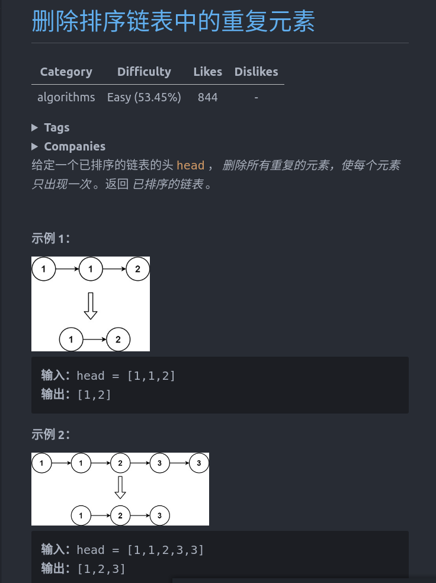

```cpp
struct ListNode {
    int val;
    ListNode *next;
    ListNode() : val(0), next(nullptr) {}
    ListNode(int x) : val(x), next(nullptr) {}
    ListNode(int x, ListNode *next) : val(x), next(next) {}
};
class Solution {
public:
    ListNode* deleteDuplicates(ListNode* head) {
        ListNode *cur = head;
        if(!cur) return nullptr;
        while(cur->next){
            if(cur->val == cur->next->val){
                cur->next = cur->next->next;
            }else{
                cur = cur->next;
            }
        }
        return head;
    }
};
```