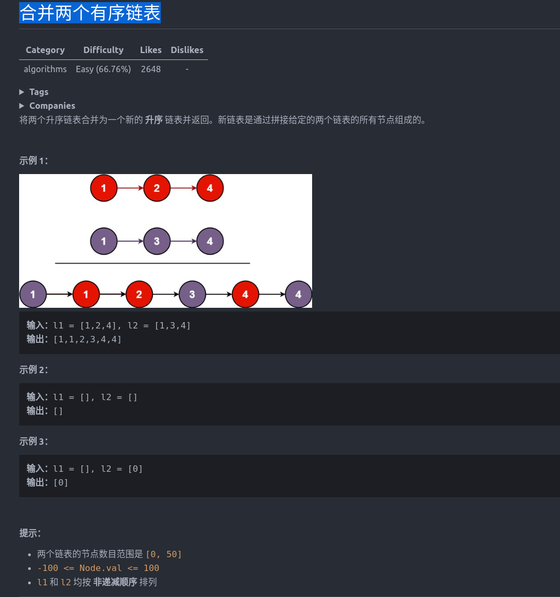
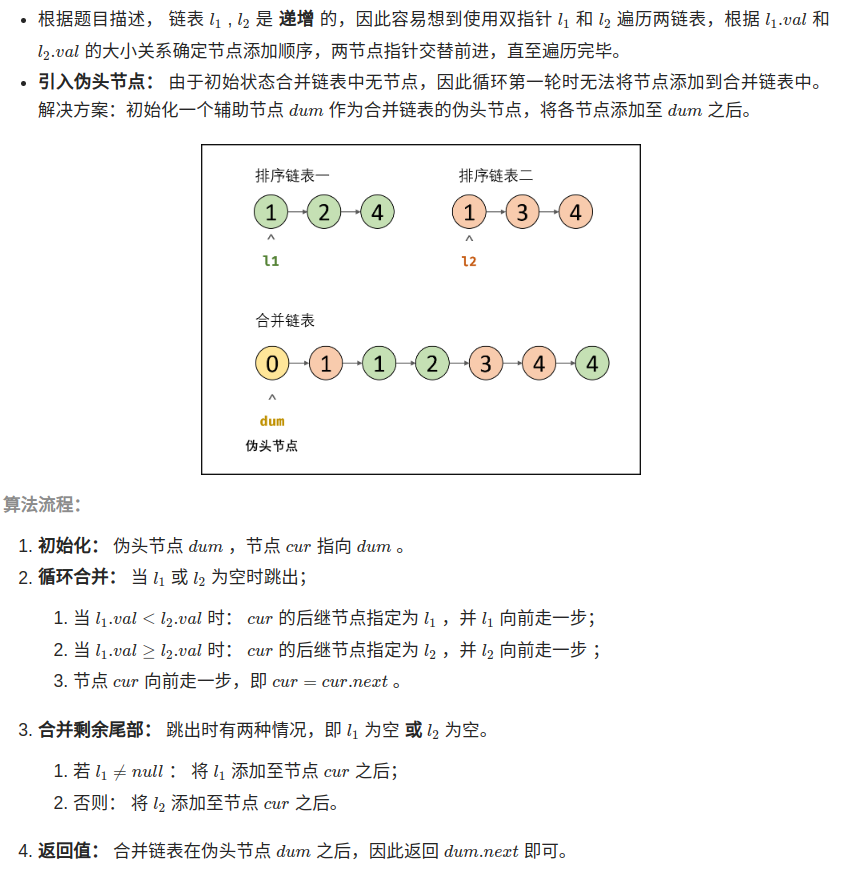

解题方法：
- 1、递归
```cpp
struct ListNode {
    int val;
    ListNode *next;
    ListNode() : val(0), next(nullptr) {}
    ListNode(int x) : val(x), next(nullptr) {}
    ListNode(int x, ListNode *next) : val(x), next(next) {}
};
class Solution {
public:
    ListNode* mergeTwoLists(ListNode* list1, ListNode* list2) {
        ListNode *p = list1, *q = list2;
        if(!p && !q) return q;
        if(!p) return q;
        if(!q) return p;
        if(q->val <= p->val){
            q->next = mergeTwoLists(p, q->next);
            return q;
        }else{
            p->next = mergeTwoLists(p->next,q);
            return p;
        }
    }
};
```

- 2、迭代

```cpp
struct ListNode {
    int val;
    ListNode *next;
    ListNode() : val(0), next(nullptr) {}
    ListNode(int x) : val(x), next(nullptr) {}
    ListNode(int x, ListNode *next) : val(x), next(next) {}
};
class Solution {
public:
    ListNode* mergeTwoLists(ListNode* list1, ListNode* list2) {
        ListNode *pre = new ListNode(-1);
        ListNode *cur = pre;
        //双指针 list1和list2指向第一个结点 直到list1或list2指向空时循环结束
        while(list1 !=nullptr && list2 != nullptr){ 
            if(list1->val <= list2->val){
                cur->next = list1;
                list1 = list1->next;
            }else{
                cur->next = list2;
                list2 = list2->next;
            }
            cur = cur->next;
        }
        //list1为空时 cur指向list2;反之
        cur->next = (list1 == nullptr ? list2 : list1);
        return pre->next;
    }
};
```