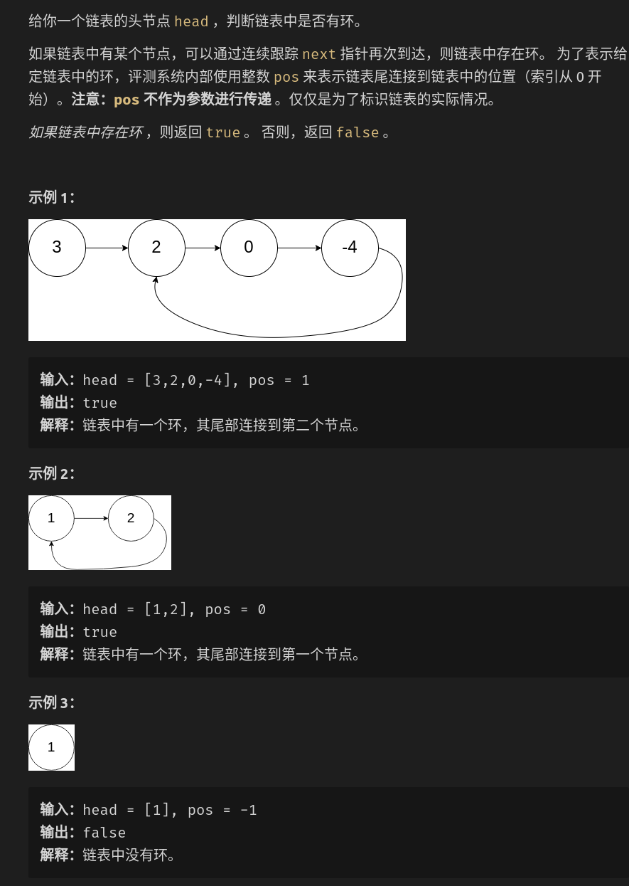

解法1：使用哈系表，判断一个结点是不是重复出现

解法2：使用快慢指针
```cpp
struct ListNode {
    int val;
    ListNode *next;
    ListNode(int x) : val(x), next(NULL) {}
 };
class Solution {
public:
    bool hasCycle(ListNode *head) {
       if(head == nullptr || head->next == nullptr) return false;
       ListNode *slow = head, *fast = head;
       //快指针是否到链表尾
       while(fast && fast->next){
            //慢指针移动一步，快指针移动两步
            slow = slow->next;
            fast = fast->next->next;
            //若相等，存在环
            if(slow == fast){
                return true;
            }
       }
       return false; 
    }
};
```