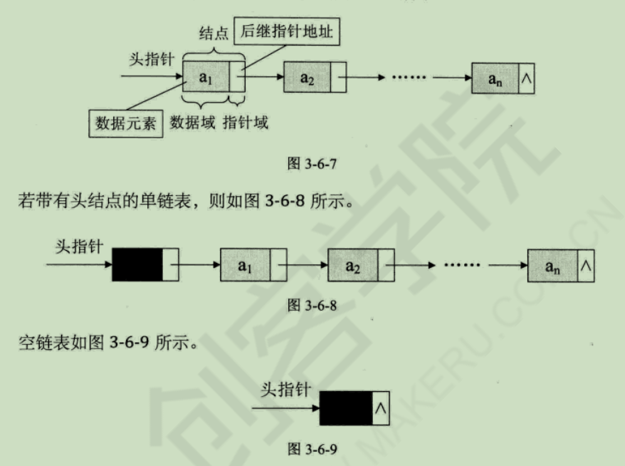
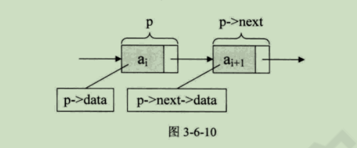
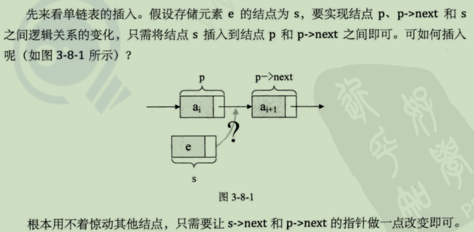
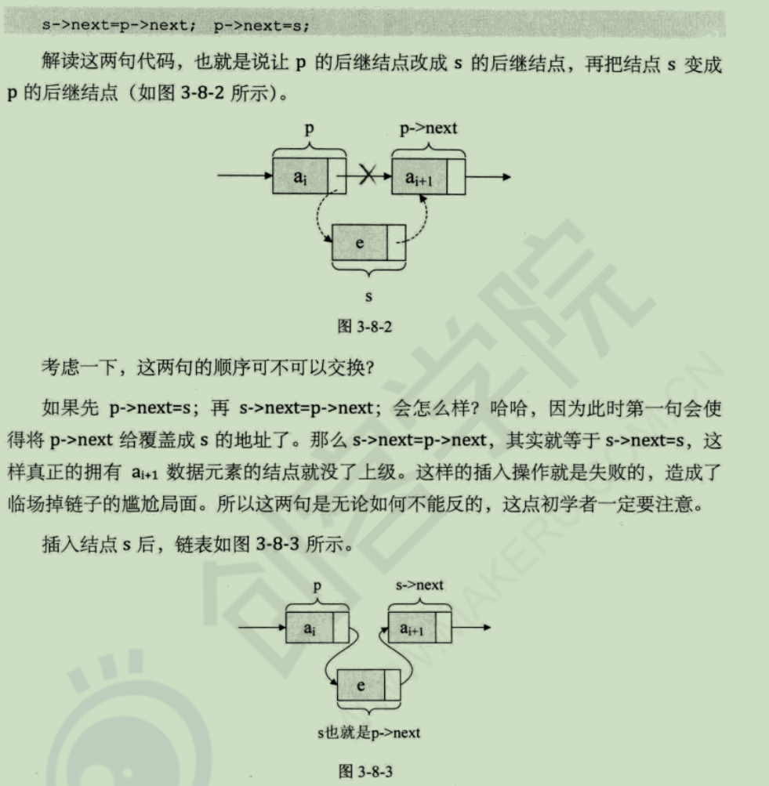
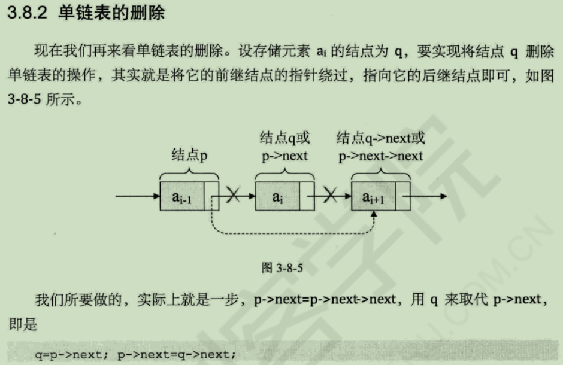
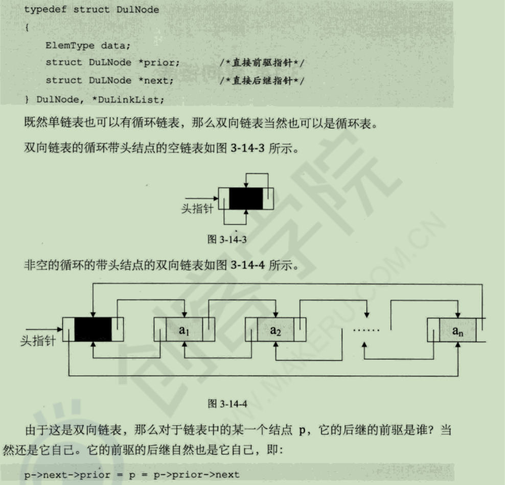
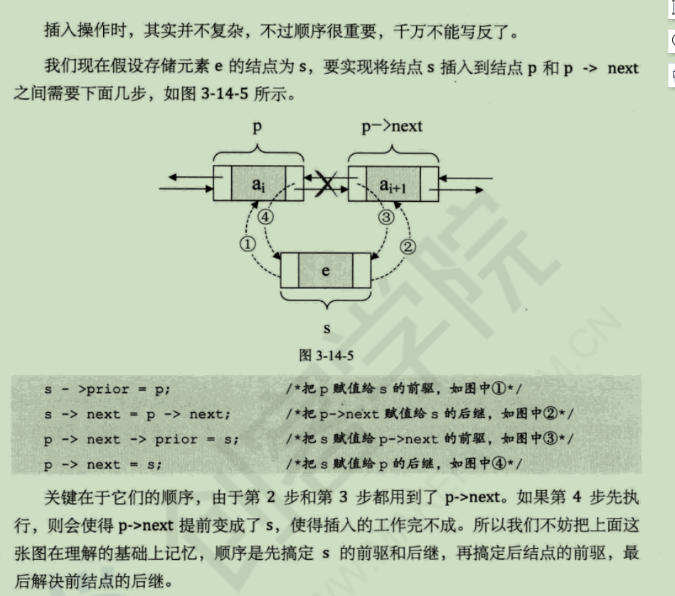
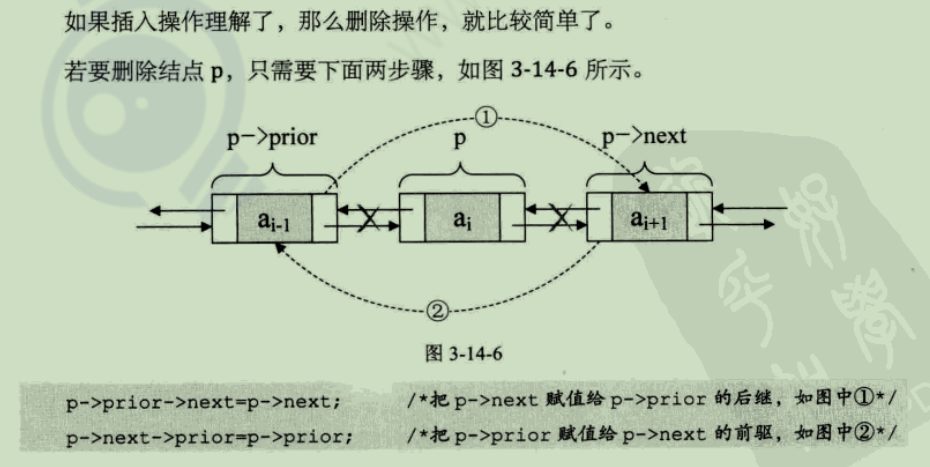

# 线性表

线性表有如下操作：
- 1、初始化
- 2、清空
- 3、查找
- 4、获取长度
- 5、插入
- 6、删除
- 7、增加

## 线性表的链式存储结构

链式存储结构的特点：存储单元可以是连续的，也可以是不连续的。

结点(Node)包含**数据域**和**指针域**。

链表中的**第一个结点的存储位置叫做头指针**，最后一个结点的指针域指向"空"(NULL)。注：为了方便对链表进行操作，会在单链表的第一个结点前增设一个结点，称为**头结点**。头结点数据域不存储任何信息，指针域存储指向第一个结点的指针。



```cpp
//线性表的单链表存储结构
typedef struct Node{
    ElemType data;
    struct Node *next;
}Node;
typedef struct Node *LinkList;
```



### 单链表的查找
```cpp
/* 
初始条件：单链表存在，且 1 <= i <=ListLength(L)
操作结果：用e返回L中第i个数据元素的值。若元素不存在返回0
*/
int GetElem(LinkList &L, int i, int &e)
{
    int j = 1;
    LinkList p = L->next;
    while(p && j < i){
        p = p->next;
        ++j;
    }
    if(!p) return 0;
    e = p->data;
    return e;
}
```
注：因为单链表并未定义长度，所以不方便使用for循环。核心思想就是"**工作指针后移**"。

### 单链表的插入


```cpp
/*
----------------插入操作--------------
初始条件：单链表存在，且 1 <= i <=ListLength(L)
操作结果：向L中第i个位置后插入e，插入成功返回true,失败false
*/
bool ListInsert(LinkList &L, int i, int &e)
{
    int j = 1;
    LinkList p = L->next;
    while(p && j < i){
        p = p->next;
        ++j;
    }
    if(!p){
        cout << "第i个元素不存在" << endl;
        return false;
    }
    LinkList s = new Node;
    s->data = e;
    s->next = p->next;
    p->next = s;
    cout << "插入成功" << endl;
    return true;
}
```

### 单链表的删除

```cpp
/* 
---------------删除操作------------
初始条件：单链表存在，且 1 <= i <=ListLength(L)
操作结果：删除L的第i个数据元素，并用e返回其值，L的长度减1
*/
int ListDelete(LinkList &L, int i, int &e)
{
    int j = 1;
    LinkList p = L->next, q = new Node, tq = L;
    while(p && j < i){
        tq = p;
        p = p->next;
        ++j;
    }
    if(!(p->next)){
        cout << "位置i是尾结点" << endl;
        e = p->data;
        delete p;
        tq->next = nullptr;
        return e;
    }
    q = p->next;
    p->next = q->next;
    e = q->data;
    delete q;
    cout << "删除成功" << endl;
    return e;
}
```

### 单链表的建立

- 1、 头插法
```cpp
//------------------单链表建立----------------
/* 
    头插法 建立带表头结点的单链表
    新结点永远在第一的位置
*/
void CreatListHead(LinkList &L, int n)
{
    L->next = nullptr;
    srand(time(0));
    for(int i = 0; i < n; ++i){
        LinkList p = new Node;
        p->data = rand()%100 + 1;
        p->next = L->next;
        L->next = p;
    }
}
```

- 2、尾插法
```cpp
/* 
    尾插法  新结点永远在最后位置
*/
void CreatListTail(LinkList &L, int n)
{
    cout << "开始尾插法建立单链表" << endl;
    L->next = nullptr;
    LinkList p, s = L;
    srand(time(0));
    for(int i = 0; i < n; ++i){
        p = new Node;
        p->data = rand()%100 + 1;
        s->next = p;
        s = p;
    }
    s->next = nullptr;
}
```

### 单链表的删除
```cpp
/* 
------------------删除单链表----------------
*/
bool clearList(LinkList &L)
{
    LinkList p = L->next, q;
    while(p){
        q = p->next;
        delete p;
        p = q;
    }
    L->next = nullptr;
}
```

### 单链表的遍历和求长
```cpp
/* 
-------------------单链表的遍历----------------
*/
void traverseList(LinkList &L)
{
    LinkList p = L;
    if(p->next == nullptr) cout << "单链表为空" << endl;
    while(p->next){
        p = p->next;
        cout << p->data << endl;
    }
}

/* 
------------------单链表的长度-------------
*/
int lengthOfList(LinkList &L)
{
    LinkList p = L;
    int count = 0;
    while(p->next){
        p = p->next;
        ++count;
    }
    return count;
}
```

## 双向链表

**双向链表是在单链表的每个结点中，再设置一个指向其前驱结点的指针域。**


### 双向链表的插入和删除

相较于单链表，在插入和删除时，需要更改两个指针的变量

