# 栈与队列

**栈仅允许在表尾进行插入和删除操作的线性表。**

**队列只允许在队尾进行插入操作，而在队首进行删除操作的线性表。**

## 栈
- 栈的性质：
  - 1、先进后出
  - 2、允许删除和插入的一端为栈顶，另一端为栈底

- 栈的抽象数据类型：
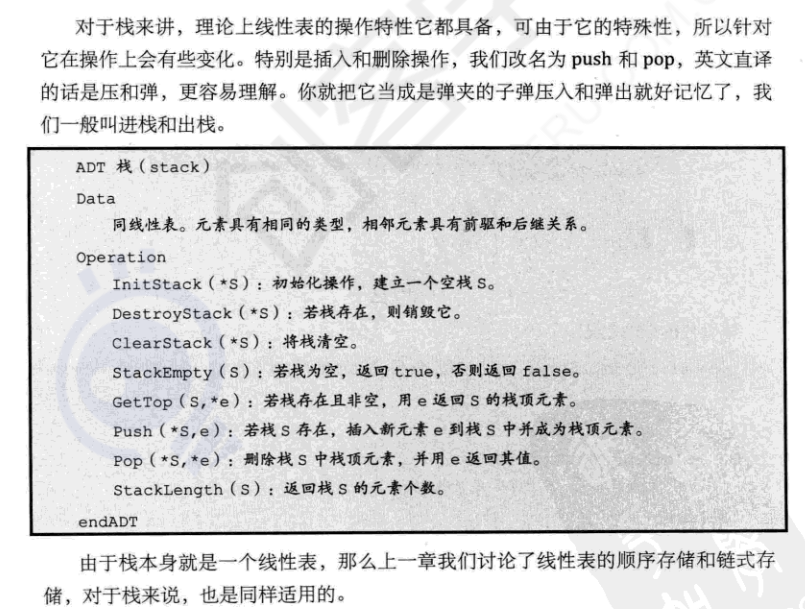

## 栈的顺序存储结构:
- 使用变量top来表示栈顶元素所在位置，空栈时top = -1;
- 进栈操作：
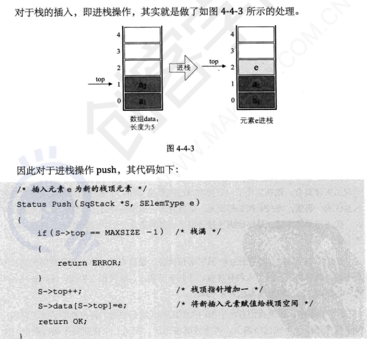
- 出栈操作：
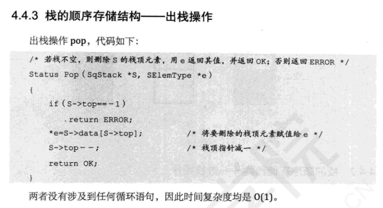 

## 栈的链式存储结构
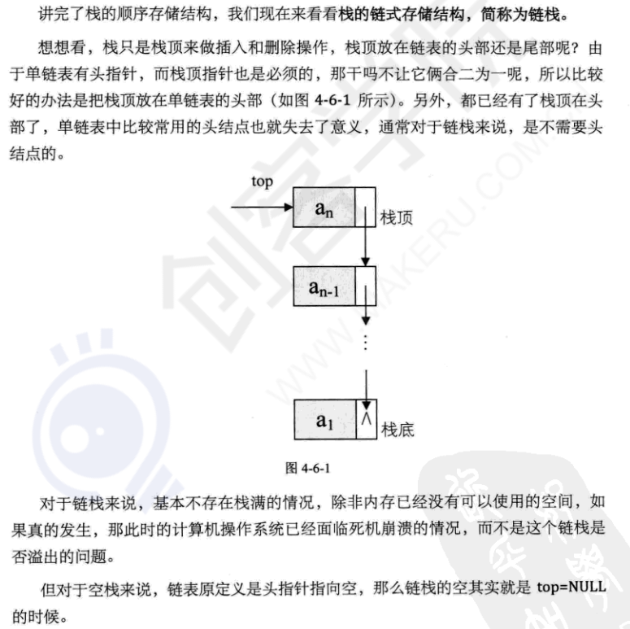

- 链栈的结构代码：
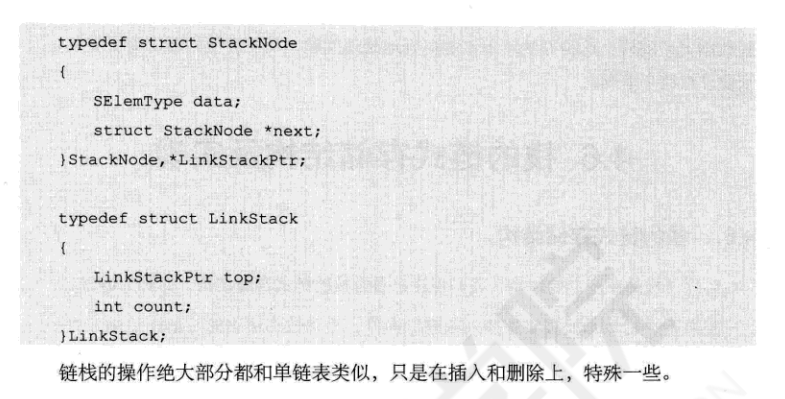
- 进栈操作
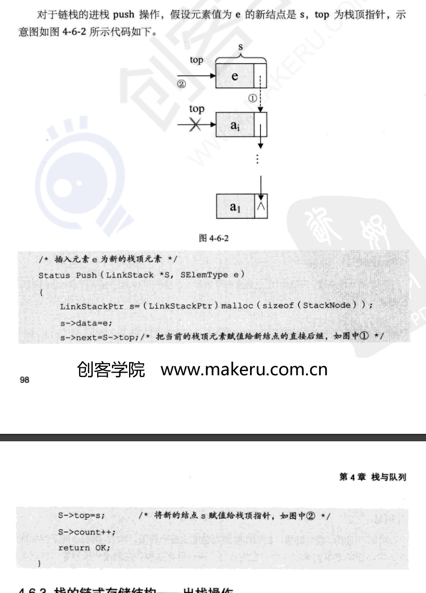
- 出栈操作
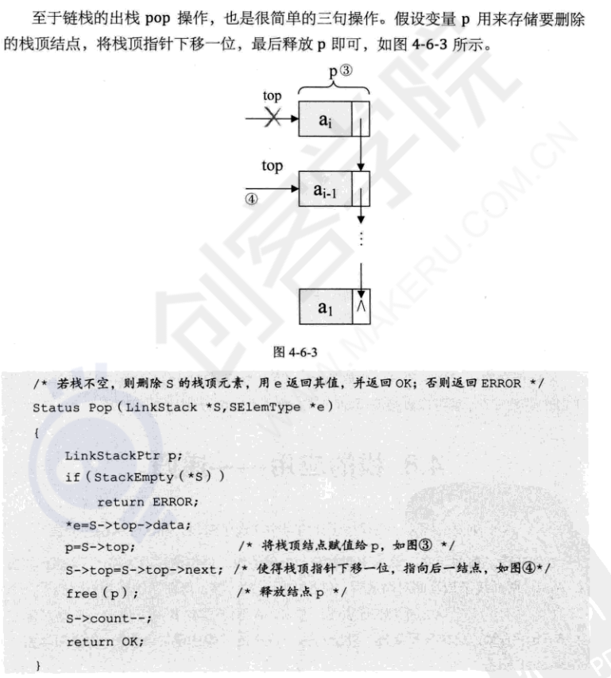

## 栈的应用

1、斐波那契数列：迭代和递归

- 迭代：
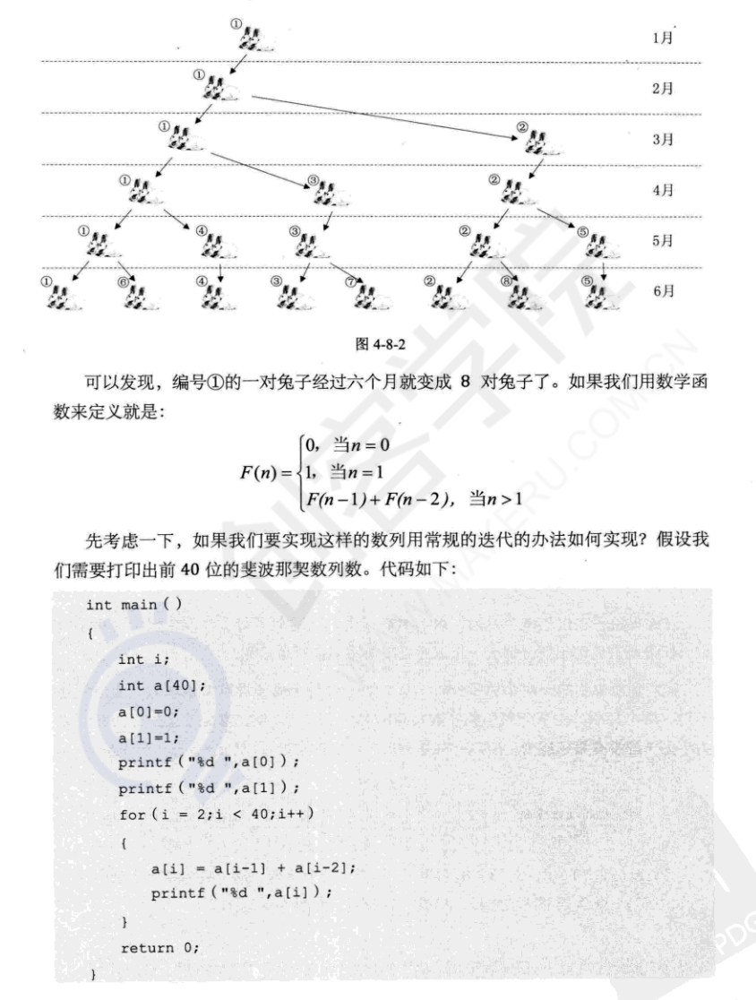

- 递归：
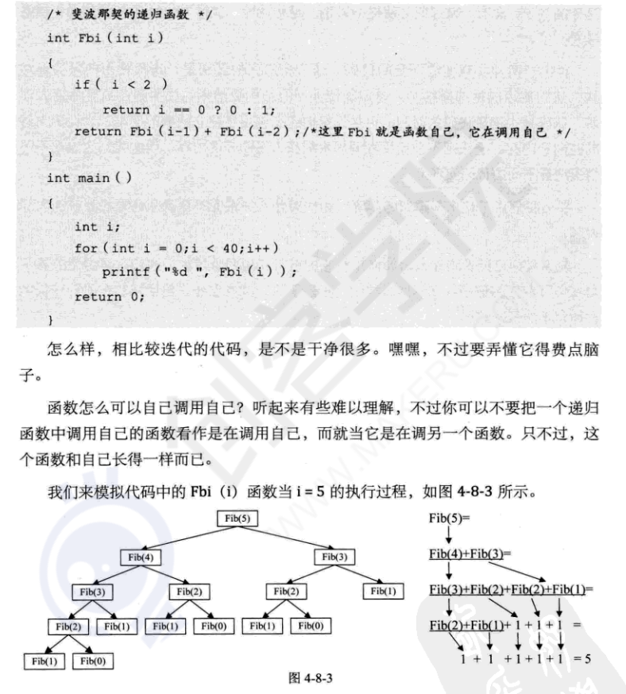

为避免死循环，递归必须至少定义一个条件，满足时递归不再进行，即不再引用自身而是返回值推出。

**递归和迭代的区别:**
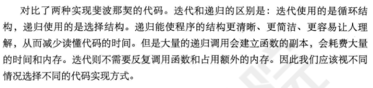

2、四则运算表达式求值

- 后缀(逆波兰)表示法：不需要括号的后缀表达式
例如："9+(3-1)x3+10➗2"，对应的后缀表达式为："9 3 1 - 3 * + 10 2 / +"
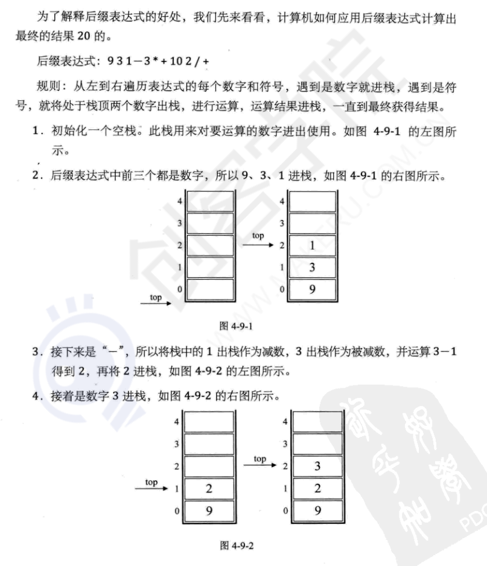

**如何得到后缀表达式**：平时标准四则运算表达式，即"9+(3-1)x3+10➗2"叫做中缀表达式。**从中缀表达式转换到后缀表达式**：

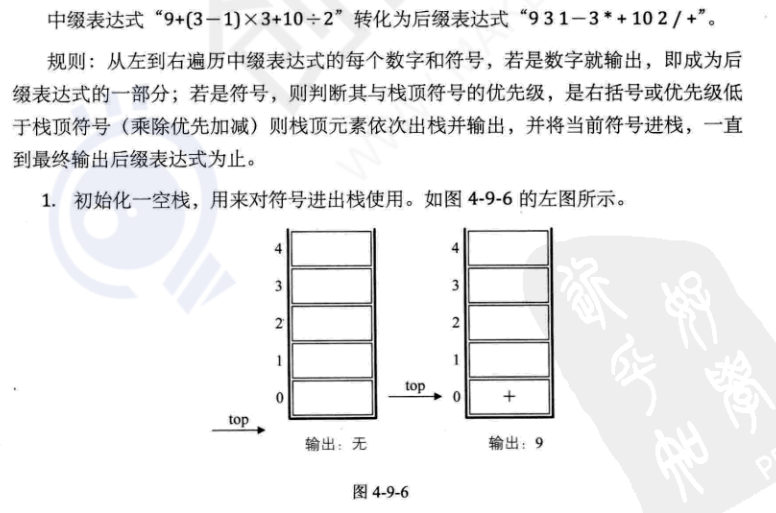
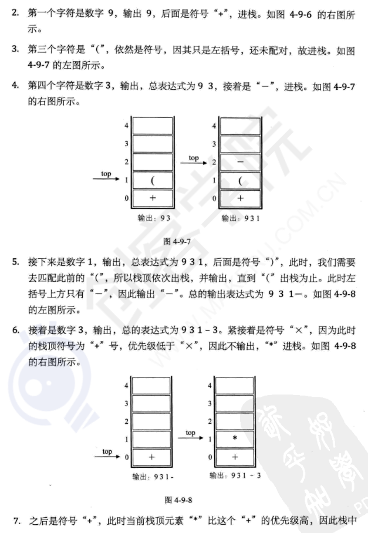
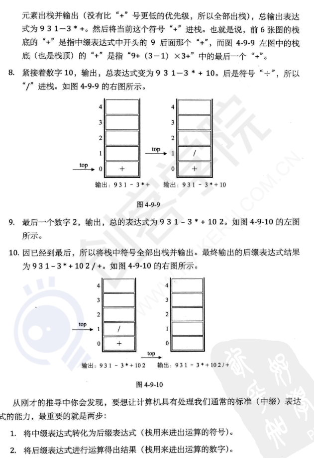