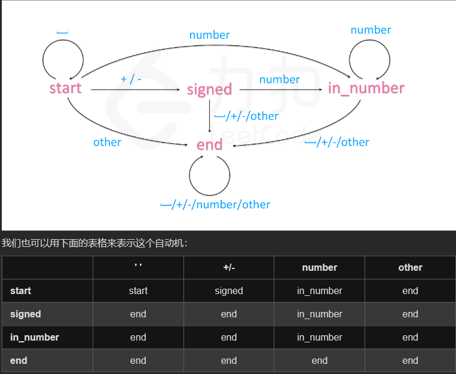
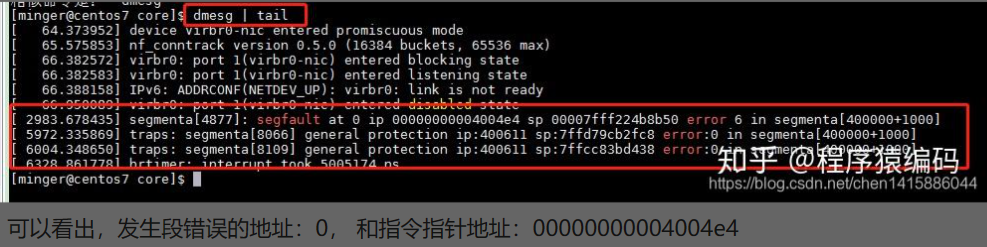

# 7.1机试
## 岗位及题型
-   岗位：C语言开发实习生
-   题型：13道选择，2道填空，2道编程(1mid, 1hard)

### 选择题相关知识点

#### C字符串函数

`strcat`、`strcpy`、`strlen`
```c
#include <stdio.h>
#include <string.h>

int main () {
    char str1[10] = {'n', 'o', 'w'}, str2[] = "coder", str3[] = "abcde";
    printf("%d%d%d\n", strlen(str1),strlen(str2),strlen(str3));
    strcat(str1, str3);
    printf("%s %d\n", str1, strlen(str1));
    strcpy(str1 + strlen(str2), str2);
    printf("%s %d\n", str1, strlen(str1));
    /**
    355
    nowabcde 8
    nowabcoder 10
    */
    return 0;
}
```

#### 求数位无重复数字的十进制三位偶数有多少个？
328
```c
#include <stdio.h>
#include <string.h>


int cal(int i, int j, int k) {
    return i * 100 + j * 10 + k;
}
int main () {
    int cnt = 0;
    for (int i = 1; i <= 9; i += 1) {  // 百位数字（偶数，包括零）
        for (int j = 0; j <= 9; ++j) {  // 十位数字
            if (j != i) {
                for (int k = 0; k <= 9; k += 1) {  // 个位数字（偶数）
                    if (k != i && k != j && cal(i,j,k) % 2 == 0) {
                        ++cnt;
                    }
                }
            }
        }
    }
    printf("%d\n", cnt);
}
```

#### 网络地址IP有效范围

>10.174.20.176/28该网段的有效ip地址是多少

**chatgpt:**<br>
给定网段为10.174.20.176/28，其中"/28"表示子网掩码的长度为28位，即子网掩码为255.255.255.240。要确定该网段的有效IP地址，需要找到该网段的网络地址和可用的主机地址范围。

网络地址计算：
将给定的IP地址和子网掩码进行逻辑与操作，得到网络地址。
IP地址：   10.174.20.176<br>
子网掩码： 255.255.255.240<br>
逻辑与：   --------------<br>
网络地址： 10.174.20.176<br>

主机地址范围计算：
对于给定的子网掩码长度为28位，它留下了4位用于主机地址。主机地址的范围为从网络地址的下一个地址到广播地址的前一个地址。

网络地址：  10.174.20.176<br>
下一个地址： 10.174.20.177 (网络地址+1)<br>
广播地址：  10.174.20.191 (网络地址+2^4-1)<br>

因此，有效的主机地址范围为10.174.20.177到10.174.20.190。

所以，给定网段10.174.20.176/28的有效IP地址范围是10.174.20.177到10.174.20.190。

### 编程题

#### 实现一个myAtoi(string s)函数
[leetcode 8-字符串转换整数(atoi)](https://leetcode.cn/problems/string-to-integer-atoi/)

```cpp
class Solution {
public:
    int myAtoi(string s) {
        int ans = 0;
        int n = s.size();
        int i = 0;
        //清除前导空格
        while (i < n && s[i] == ' ') {
            ++i;
        }
        //判断符号位
        int sign = 1;
        if (s[i] == '-') {
            sign = -1;
            ++i;
        } else if (s[i] == '+') {
            ++i;
        }
        long long num = 0;
        //字符串转整数：注意边界条件
        while (i < n && isdigit(s[i])) {
            num = num * 10 + (s[i] - '0');
            if (sign * num > INT_MAX) {
                return INT_MAX;
            } else if (sign * num < INT_MIN) {
                return INT_MIN;
            }
            ++i;
        }
        return sign * num;
    }
};

```
**有限状态机解法：**

```cpp
class Automaton {
    string state = "start";
    unordered_map<string, vector<string>> table = {
        {"start", {"start", "signed", "in_number", "end"}},
        {"signed", {"end", "end", "in_number", "end"}},
        {"in_number", {"end", "end", "in_number", "end"}},
        {"end", {"end", "end", "end", "end"}}
    };

    int get_col(char c) {
        if (isspace(c)) return 0;
        if (c == '+' or c == '-') return 1;
        if (isdigit(c)) return 2;
        return 3;
    }
public:
    int sign = 1;
    long long ans = 0;

    void get(char c) {
        state = table[state][get_col(c)];
        if (state == "in_number") {
            ans = ans * 10 + c - '0';
            ans = sign == 1 ? min(ans, (long long)INT_MAX) : min(ans, -(long long)INT_MIN);
        }
        else if (state == "signed")
            sign = c == '+' ? 1 : -1;
    }
};

class Solution {
public:
    int myAtoi(string str) {
        Automaton automaton;
        for (char c : str)
            automaton.get(c);
        return automaton.sign * automaton.ans;
    }
};

```

#### 最长重复子串
[leecode-1044最长重复子串](https://leetcode.cn/problems/longest-duplicate-substring/)<br>
太难了，暂时放弃，下次一定


# 7.8 电话技术一面

## 自我介绍

稀烂！:)

## 八股

>1、程序出现`segment falut`,原因? 

在Linux下C/C++中，出现段错误很多都是有指针造成的，指针声明后没有内容的存储空间，当你不指向指定的内存空间时，就会出现segmentation fault(段错误)，这种情况往往能编译通过的，但是运行时就会出现在段错误。

段错误`segmentation fault`，信号`SIGSEGV`，是由于访问内存管理单元MMU异常所致，通常由于无效内存引用，如指针引用了一个不属于当前进程地址空间中的地址，操作系统便会进行干涉引发`SIGSEGV`信号产生段错误。

**产生原因：**

-   空指针：空指针访问即操作地址为0的内存区域(**该区域禁止访问**)。
```cpp
#include <stdio.h>

int main(int argc, char* argv[])
{
    int* ptr = NULL;
    *ptr = 0;
    
    return 0;
}
```
-   野指针：野指针通常有两种情况，一种是指针未初始化，指针定义后是不会自动初始化为`NULL`指针，它的缺省值是随机的，所以指针定义的时候就应该初始化为`NULL`或者合法内存；第二种是指向的内存已经释放，使用`free`或者`delete`操作并不会对指针本身进行清除，释放完后应该对指针进行重置，或者指向的对象已经超出了对象作用域范围，离开作用域的时候也应该对指针进行重置；
```cpp
#include <stdio.h>
#include <string.h>


int main(int argc , char *argv[])
{
	char *source1 = "abc";
	char *source2;
	
	printf("first source2 is : %u\n",source2);
	strcpy(source2,source1);
	printf("second source2 is : %s\n");
	
	return 0;
}
/**
 这段程序定义了一个指向字符的指针source2，但是没有给它一个初始值。由于source2在定义时没有给初值，程序运行时系统会默认给source2一个值(732373280)，而732373280是一个内存的地址，至于是哪段内存地址，谁也不知道，可能是操作系统本身所在的内存地址，也可能是一个空的内存地址。

野指针是危险的因为它不像空指针一样可以通过判断来识别是否指向合法内存，它可能指向一块不存在的内存页，也可能是指向一块没有访问权限的内存区域，如果是这样你应该感谢segmentation fault段错误，因为问题很快就会暴露出来而不会被蔓延，否则如果指向了一块合法内存，那对内存的破坏将会有无法预测的事情发生，可能只是纂改了你的数据，也可能是破坏了内存结构，这个时候错误可能被蔓延到一个无法预测的时刻。

 * /
```

-   堆栈越界：
    -   **堆越界**破坏的是堆内存空间，堆空间通常由malloc/new分配，free/delete进行回收，由于堆内存空间分配的时候并不一定是连续的，所以如果发生堆越界可能破坏的内存属于一个毫无关系的对象，堆越界通常都会破坏堆内存结构，导致后续分配或者回收内存的时候出现异常。
    -   **栈越界**破坏的栈内存空间，栈空间是由系统自动分配和回收，栈空间分配是从高地址象低地址连续分配的，所以当出现栈越界破坏的都是相邻的数据块，栈越界通常修改当前函数返回地址，参数或者局部变量，如果返回地址被修改可能会产生指令错误或者执行非预期的代码，所以黑客通常通过栈越界来插入后门。

-   数组访问越界

**段错误信息的获取:**

-   `demsg命令`：`dmesg`命令显示linux内核的环形缓冲区信息，我们可以从中获得诸如系统架构、cpu、挂载的硬件，RAM等多个运行级别的大量的系统信息。该命令会给出出现段错误的地址和`ip`及`sp`地址。


-   `gdb + core`:
    -   1、默认编译出来的程序出现`segment fault`时并没有产生`core`文件，可以在`gcc\g++`编译时增加`-g`选项。\
    -   2、若仍未有`core`文件，可能系统默认设置了`core`文件大小为0，通过`ulimit`命令查看和设置即可。
    -   3、`gdb ./运行文件 core`即可查看出错所在行信息，进入调试模式。


>2、程序出现`core dump`,原因？如何使用`gdb`调试?

`core dump`介绍：

-   概念：当程序运行的过程中异常中止或崩溃，操作系统会将程序当时的内存状态记录下来，保存在一个文件中，这种行为叫`core dump`，对于调试很重要。
-   `gdb`调试过程：如上面一个问题，进入调试模式后，输入`bt`或`where`查看栈帧，后进一步调试。


>3、了解汇编语言？内核中(汇编程序)出现`bug`了，如何定位？

-   第一步：查看日志信息，分析日志
-   第二步：使用调试工具`gdb or kdb(linux内核调试工具)`


>4、`gdb`常见的命令？

>5、介绍一下`Linux`中的锁？自旋锁的原理？

>6、说一下`Linux`中进程间通信的方式？

>7、说一下`Linux`中的`IO`?阻塞`IO`和非阻塞`IO`的区别？

>8、开发过程中有没有出现内存泄漏的情况？内存泄漏的原因？如何`debug`内存泄漏？

内存分析工具：`Valgrind`,命令行检测。

>9、数据库了解吗？sqlite?

## 项目

几乎没问。

## 反问

1、这是招实习生吗？

2、这算是技术一面吗？

3、实习多久?

4、面试表现如何?


# 7.13 hr面

无营养，瞎jer聊

无餐补，996，要求实习满5个月

竞赛、成绩、英语四六级、挂科、未来规划啥的
