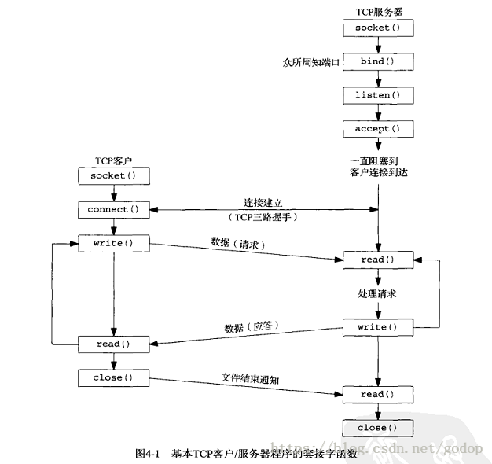

# 计算机网络相关问题

## 1、常见HTTP状态码

-   `2xx`：表示服务器成功处理客户端请求
    -   [200 OK]:一切正常
    -   [204 NO Content]:与200 OK基本相同，但响应头无`body`数据
-   `3xx`: 表示客户端用新的URL重新发送请求获取资源，**重定向**
-   `4xx`: 客户端报文有误
    -   [404 Not Found]: 请求的资源在服务器中找不到或未找到
-   `5xx`: 客户端正常，**服务器处理时内部发生错误**。

## 2、HTTP常见字段有哪些？

-   `Host`字段: 指定服务器域名，www.baidu.com
-   `Content-Length`字段：服务器返回数据，指明本次回应的数据长度
-   `Connection`字段：用于客户端要求服务器使用TCP长久连接，HTTP/1.1默认持久连接
-   `Content-Type`字段：数据格式

## 3、GET与POST的区别？

-   `GET`：从服务器获取资源
-   `POST`:向URI提高资源数据，数据放在`body`中
-   `GET`是只读的，安全的、幂等的；`POST`反之。

## 1、tcp三次握手，accept对应三次握手中的哪一次？

`TCP`服务端和客户端连接模型如下所示：

`accept`应该位于第三次握手之后，我们来看看`TCP`连接过程：

-   初始：客户端处于CLOSED状态，而服务器端从CLOSED状态变为LISTEN状态

-   第一步：客户端发送一个SYN序列号

-   第二步：服务器端接收来自客户端的连接请求，并返回ACK+SYN

-   第三步：客户端接收消息，返回ACK

-   第三步之后，服务器接收到消息，连接就完成了。这样就可以调用`accept`函数获得此连接。

accept其实也可以在第三步，原因是，此时accept函数要给此次连接分配资源，最初是想这样设计；但是，设想如果有10000甚至更多个客户端都和该服务器连接，发送SYN，服务端收到之后，这些客户端却不再理会服务端的回复，然而此时服务端的资源却都用accept()分配了。这就是所谓的DDOS攻击。

为了解决这个问题，**`accept()`于是被放在三次握手之后**。
