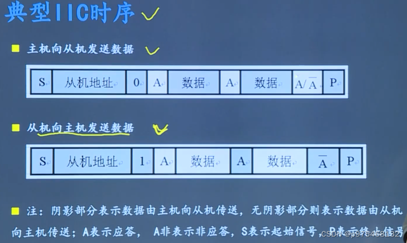
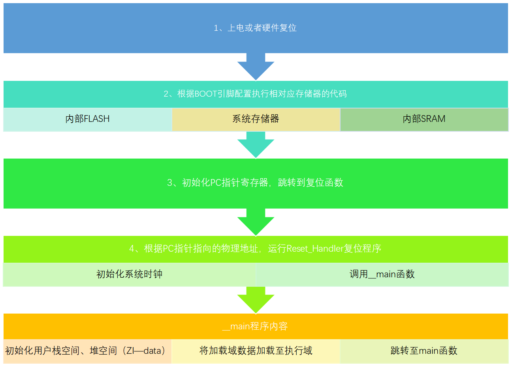

# 基于ROS的室内移动机器人

## 这个项目中你主要负责什么？

主要负责项目软件环境搭建，keil + vscode,分析硬件电路图编写底层软件代码和移植FreeRTOS，如ADC采样电压、制定串口通信协议、模拟IIC读取传感器MPU6050的数据、DMA定长数据串口传输、PID调速等，ROS上层软件开发实现建图与导航等功能。

## 代码量多少？
C:
15个.c文件 15 * 200
15个.h文件 15 * 100
main.c    54

C++:
1个.cpp和1个.h 1000
一些python文件 launch文件 

总计 5000行以上


## 控制逻辑
-	定时器7每20ms中断一次：执行喂狗指令和电源指示灯显示->ADC采样
-	串口1中断接收数据，使用DMA传输数据
- 	FreeRtos任务1：实现增量式PID调速 10ms
-	FreeRtos任务2：将底层数据通过串口发送给上位机 10ms


## 通信协议如何制定?
使用`union`联合体和`#pragma pack(1)`预编译指令，使通信协议数据的`77字节`按`1字节`对齐。
优点：不需要注意移动、字节大小端和字节序等问题，便于解析
```c
#define PROTOCOL_HEADER		0XFEFEFEFE
#define PROTOCOL_END		  0XEE
 
#define PROTOCL_DATA_SIZE 77


#pragma pack(1)
typedef struct __Mpu6050_Str_
{
	short X_data;
	short Y_data;
	short Z_data;
}Mpu6050_Str;

typedef struct __Moto_Str_
{
	float Moto_CurrentSpeed;
	float Moto_TargetSpeed;
}Moto_Str;

typedef union _Upload_Data_   
{
	unsigned char buffer[PROTOCL_DATA_SIZE];
	struct _Sensor_Str_
	{
		unsigned int Header;	
		float X_speed;					
		float Y_speed;			
		float Z_speed;			
		float Battery_Voltage_;
		
		Mpu6050_Str Link_Accelerometer;		
		Mpu6050_Str Link_Gyroscope;			
		
		Moto_Str MotoStr[4];		
		float PID_Param[3];					
		
		unsigned char End_flag;			
	}Sensor_Str;
}Upload_Data;
#pragma pack(4)
```


## 相关知识点？

### IIC通信

> 硬件IIC与软件IIC的区别？

硬件IIC通信接口只有两个，不太灵活。\
软件模拟IIC，使用GPIO模拟IIC时序，比较灵活，易移植。

#### IIC通信特点:
-   串行、半双工同步通信，通信可以双向，MCU向外设或者外设向MCU
-	用于近距离、低速芯片之间的通信
-   两根线，SDA数据线，SCL时钟线
-	连接在IIC总线上的器件分为主机和从机；当总线上有多个主机同时启用总线，IIC具有冲突检测和仲裁的功能。

#### IIC总线寻址方式：

**主机在发送起始信号后，必须发送一个字节的数据(采用大端存储-先发送高位，再发低位)，数据的高7位表示从机地址，最低位表示后续字节的传送方向, 0表示主机发送数据，1表示主机接收数据。**

#### 软件模拟IIC控制信号时序：
-   开始信号：SCL高电平，SDA由高电平向低电平跳变
-   发送控制指令：即IIC总线进行数据传送，SDA数据线上的数据必须在SCL的高电平期间保持稳定，数据线的电平状态只有在SCL为低电平改变。**不论主机还是从机，读取数据时SCL为高电平，发送数据时SCL为低电平。**
-   应答信号：低电平应答，高电平非应答。
-   结束信号：SCL为高电平时，SDA由低电平向高电平跳变。



### DMA+串口定长数据收发

自定义的串口通信协议为77个字节，波特率为115200，正常情况下发送时间过长，采用DMA+串口定长数据收发。

#### DMA定长数据传输：

DMA定长数据传输是一种数据传输模式，其中DMA控制器从源设备（例如硬盘）复制固定长度的数据块到目标内存位置，或者将固定长度的数据块从内存写入目标设备，而无需CPU的介入。

#### 空闲中断

空闲中断是一种中断类型，它在CPU空闲时触发。CPU通常执行各种指令，包括读取、写入数据、执行计算等。当CPU空闲下来时，系统可以利用这段时间执行其他任务，比如处理一些后台任务、数据传输等。

在DMA中，当一个数据传输完成时，DMA控制器可能会发出一个空闲中断信号给CPU。这意味着DMA传输已经完成，CPU可以继续执行其他任务。通过利用空闲中断，系统可以实现高效率的数据传输，而不必等待整个传输过程完成。

综合起来，DMA定长数据传输通过允许外部设备直接与内存交互，减少了CPU的负担，提高了数据传输效率。空闲中断则在DMA传输完成时通知CPU，使CPU能够更加有效地利用空闲时间。这些技术共同促进了系统性能的提升和资源的优化利用
### 增量式PID

-  P:比例控制，作用是快速减小偏差，但是容易出现超调，导致系统的稳定性差
-  I:积分控制，消除稳态误差，使系统最终稳定在设定值附近。
-  D:微分控制：减小超调和抑制振荡，使系统更加稳定。

>一般情况下，如何进行PID整定？
-   手动整定法

### FreeRTOS任务相关内容

>FreeRTOS有哪几种调度方式？

-   合作式调度：很少使用
-   抢占式调度：每个任务都有不同的优先级，任务会一直运行直到被高优先级任务抢占或者遇到阻塞式API函数，如`vTaskDelay`。
-   时间片调度：每个任务有相同的优先级，任务会运行固定的时间片个数或者遇到阻塞的API函数，才会执行同优先级任务之间的任务切换。

>FreeRTOS任务创建?

`xTaskCreate`来指定任务函数、任务名称、任务栈大小、任务参数和任务优先级。创建任务后，它将开始在RTOS内核中调度执行。

>任务状态？

-   运行态
-   就绪态
-   阻塞态
-   挂起态

### MCU 基于STM32
[https://blog.csdn.net/qq_45290757/article/details/127166619?ops_request_misc=&request_id=&biz_id=102&utm_term=MCU%E9%9D%A2%E8%AF%95%E9%A2%98&utm_medium=distribute.pc_search_result.none-task-blog-2~all~sobaiduweb~default-5-127166619.nonecase&spm=1018.2226.3001.4187](MCU 基于STM32)


### SPI总线

#### SPI特点：

-	串行外设接口：高速、全双工、同步的串行通信总线
-	主从方式。支持一主多从
-	4根线：`MISO`、`MOSI`、`SCLK`、`CS`
-	数据传送时，先传送高位，后传送低位，高电平表示1，低电平表示0
-	无需应答机制
-	八个时钟周期即可完成一个字节数据的传送。

### STM32启动过程



启动流程：`startup_stm32xxxx.s`
-	上电复位：当STM32单片机上电时，内部的复位电路将各个内部模块和寄存器置于初始状态。
-	根据`BOOT`引脚设置，将内部`Flash`或内部`SRAM`映射到`0x00`处，单片机从`Flash`中的程序启动。
-	找到中断向量表，向量表的第一个值是`Reset`复位函数指针，初始化`PC`指针，执行复位函数。
-	复位函数中断服务程序中调用`SystemInit`函数配置系统时钟、配置`FSMC`总线上的外部`SRAM/SDRAM`，然后跳转到 `C 库中__main `函数。
-	在`__main`函数中，会初始化内核的寄存器，如`R0-R15`，划分堆空间（如果使用到的话）和栈空间（栈空间是`C`语言程序能运行的必要条件，没有栈，`C`程序就无法运行），同时初始化程序数据，即将用户代码中的数据从`FLASH`中搬运到`SRAM`中，简单理解就是初始化全局变量（这也就是全局变量在C语言中不初始化也不会出现随机值的原因了）
-	进入`main`函数。